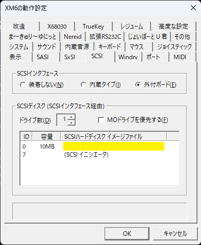
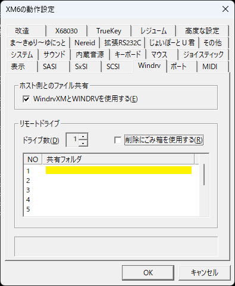
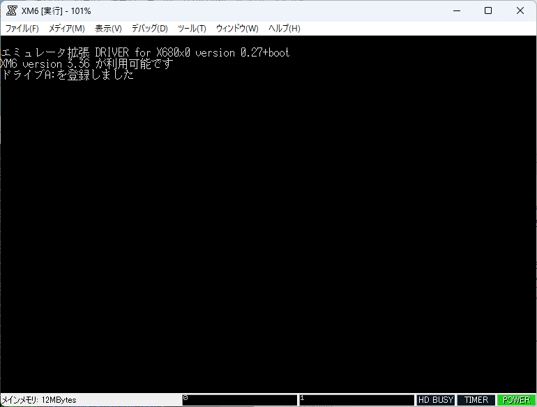
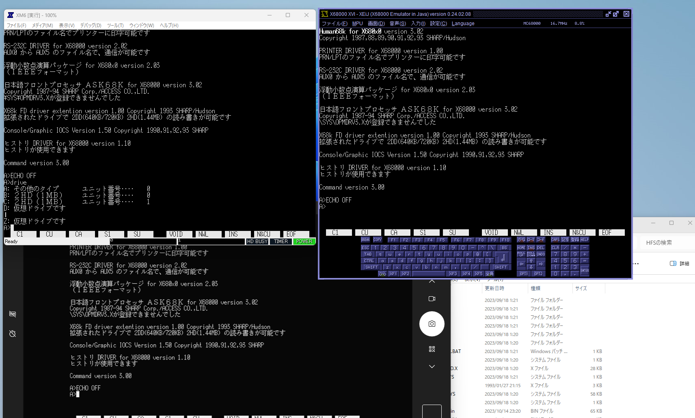

# WindrvXM-boot

## 概要

[XM6 TypeG](http://retropc.net/pi/xm6/index.html) などの X680x0 エミュレータには、エミュレータが動作するホストのファイルシステムにアクセスするための Windrv(WindrvXM) という機能があります。

`WindrvXMboot.HDS` は、co 氏作の デバイスドライバ [WindrvXM.SYS](http://coexe.web.fc2.com/WindrvXM.html) を SCSI HDD ディスクイメージ内に埋め込んで使えるようにしたものです。

ドライバを SCSI HDD 埋め込みイメージにすることで、以下のようなメリットがあります。

* CONFIG.SYS への WindrvXM.SYS の組み込みが不要\
  通常の WindrvWM.SYS はエミュレーション環境の CONFIG.SYS に `DEVICE=WindrvXM.SYS` という行を追加する必要がありますが、`WindrvXMboot.HDS` はエミュレータの SCSI ディスクイメージに設定するだけで Windrv が使えるようになります。
* Windrv からの起動が可能\
  `WindrvXMboot.HDS` を起動デバイスに設定すると、起動時の `CONFIG.SYS` やデバイスドライバ読み込みをすべて Windrv 上のファイルから行うことができるようになります。
  エミュレータ XEiJ の[ホストファイルシステム](https://stdkmd.net/xeij/feature.htm#hostfilesystem)と同様の機能が XM6 TypeG でも利用できるようになります。

## 使い方

* XM6 TypeG をインストールします。インストール時には SCSI-ROM も用意して SCSI デバイスが利用できるようにしてください。
* [リリースアーカイブ](https://github.com/yunkya2/windrvxm-boot/releases) の中にある `WindrvXMboot.HDS` を適当なディレクトリに置き、XM6 の ツール - オプション(O) の SCSI タブの「SCSIディスク」にイメージファイルとして設定します。
  
* 「Windrv」タブの「ホスト側とのファイル共有」にチェックを入れ、「リモートドライブ」にWindows 側共有フォルダのパス名を設定します。
  
* XM6 のエミュレーション環境をリセットすると、一瞬以下のような WindrvXM 組み込みメッセージが出た後に Human68k が起動します。設定した SCSI ディスクイメージからの起動であれば Windrv 内の CONFIG.SYS を使って起動を行います。他のデバイスから起動した場合も、Windrv が使えるようになっています。
  

## 使用例

XM6 TypeGがホストファイルシステムから起動できるようになったことで、
  * [XM6 TypeG](http://retropc.net/pi/xm6/index.html)
  * [XEiJ](https://stdkmd.net/xeij/)
  * [X68000 Z](https://www.zuiki.co.jp/x68000z/) ([x68kzremotedrv](https://github.com/yunkya2/x68kzremotedrv)を使用)\

の3種類の環境で同じファイルシステムを共有することができるようになります。

## その他

* 起動に使用する Human68k (version 3.02) は `WindrvXMboot.HDS` イメージ内に含まれています。
* WindrvXM は version 0.27 をベースに SCSI HDD 組み込み可能な形に修正を行っています。
* 動作確認は XM6 TypeG version 3.36 を用いています。SCSI ディスクイメージからの起動と Windrv が使えるものであれば、他のエミュレータでも利用可能なはずです。
